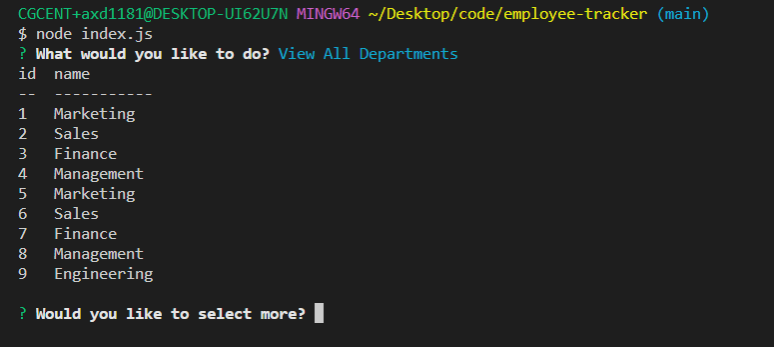

# employee-tracker

## Table of Contents

-[Description](#Description)

-[Programming Languages, Technologies/Frameworks](#Programming-Languages,-Technologies/Frameworks)

-[Installation](#Installation)

-[Contribution](#Contribution)

-[URL](#URL)

## Description

Built a command-line application from scratch to manage a company's employee database, using Node.js, Inquirer, and MySQL.

## Programming Languages, Technologies/Frameworks

- Javascript
- Inquirer
- Node.js
- MySQL

## Installation

1. Npm i express
1. npm start

## Contribution

true

### Screenshot

### URL of the GitHub Repo:

<https://github.com/adorsey5/employee-tracker>
